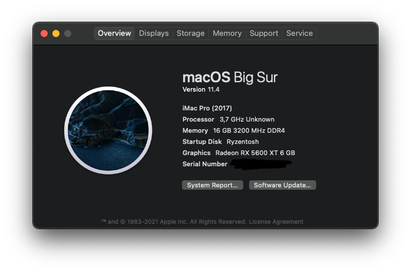

# Ryzentosh

**This only for educational purpose**

This hackintosh use open core as configuration framework.

## OS

MacOS 10.15.7

### Update Dec,22 2020

MacOS 11.1

I try to upgrade my current catalina to big sur from mac os updater, and everything works flawlessly

## Hardware
|||
|---|---|
|CPU|AMD Ryzen 5 3600|
|Motherboard|MSI B550 Tomahawk|
|RAM|Corsair Vengeance RGB Pro 2x8gb PC25600 Overclock to 3466 CL16|
|GPU|Sapphire Pulse BE RX 6500 XT|
|Boot Drive|ADATA SPG SX6000 512gb Nvme SSD|

## What doesn't Work
- This motherboard offers 2 lan port, 1 gigabit and 2.5 gigabit. on this configuration, the 2.5 gigabit lan port have been recognized on the OS, but no connection what so ever when connected.
- Fan SMC
- Virtualization like Docker,  ~~VirtualBox 6.1 or VMWare Fusion 12.1~~
- when open Photos/photo picker (i sync icloud photo), the system will freeze, the cursor will still move, music that playing on the background still continue to play, other hackintosher find the same problem here https://www.tonymacx86.com/threads/photos-app-makes-system-freeze.251513/
